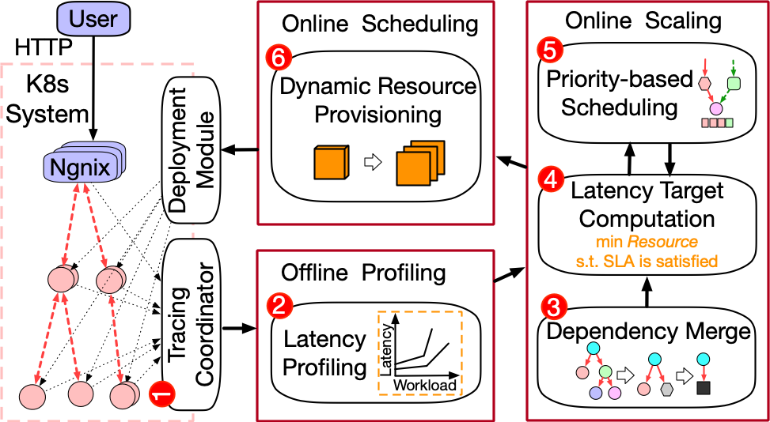
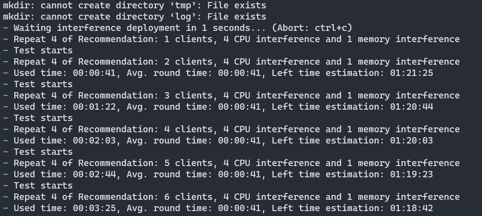
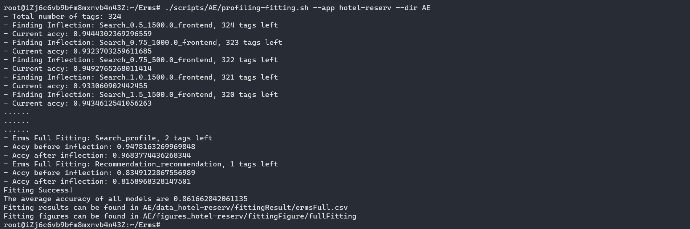
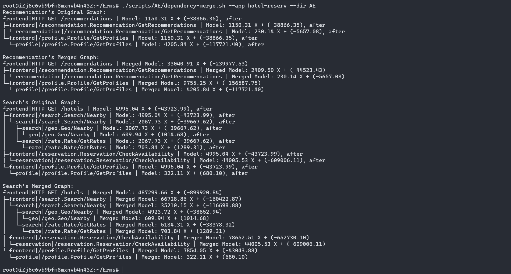
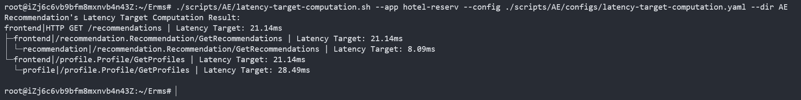
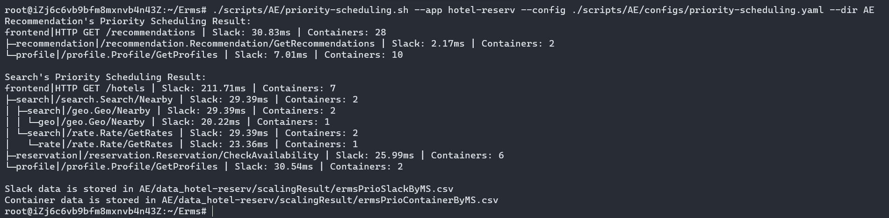
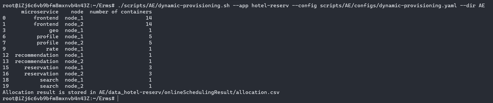

# Artifact Evaluation (AE) for Erms

## Overview

Erms is an efficient resource management framework that is mainly designed for shared microservice environments with SLA guarantees. It includes three modules, offline profiling, online scaling, and online scheduling as shown below. We evaluate Erms using DeathStarBench, including three applications, Social Network, Media Services and Hotel Reservation. Each application has one or more services; each service has multiple microservices.



## Environment

We deploy Erms on top of a Kubernetes (k8s) cluster and use Jaeger and Prometheus to collect application-level and OS-level metrics, respectively.

## Tips for users

* Before executing a script, please check the configuration and help messages of the script:
  * Configuration files can be found in `scripts/AE/configs/${module_name}.yaml`

  * Help messages can be printed by `bash scripts/AE/${target_script}.sh -h`

* We provide the estimated execution time for each script if necessary. Users could organize their schedule accordingly.
* Since some scripts take a long time, please build a screen: `screen -S session_name` , to maintain a long-live ssh connection.
* If it fails when running the script, users **SHOULD** delete the result directory if exist and run the script again.
* If the status of a worker node becomes NoReady, users could reboot the node to recover the Kubernetes cluster.

## Prepare for AE

We assume that you already have a kubernetes cluster that meets the following requirements.
* there are at least 4 nodes in the cluster, a master node and 3 slave nodes.
* each slave node has at least 4 CPUs and 8 GB RAM.
* the cluster contains Prometheus.
* copy and unzip `additionalFiles/*.zip` under `/root` on all slave nodes.
In addition, you should have some knowledge of [DeathStarBench](https://github.com/delimitrou/DeathStarBench/tree/master/mediaMicroservices) and understand the pre-requisites requirement to deploy it.

In order to test Erms, you firstly need to modify the configuration in `configs/*-global.yaml` according to your environment. Usually, the most important configurations are:
* `node_for_test`: This field list the node that you want to use to deploy stateless deployments.
* `node_for_infra`: This field list the node that you want to use to deploy stateful deployments.

You **HAVE TO** modify these two fields to let the test starts. You can also change other fields in the configuration files. You can check yaml files that started by `_example` to see each field's usage.

After that, you can use `main.py` to initialize the application, to let the program knows that which app you want to init, you can set the environment variable `ERMS_APP`, its possible values are: `social`, `hotel` and `media`.

You also need to update AE configurations in `AE/scripts/utils.py`, `CONFIG` variable. It's similar to those yaml files mentioned above.

## Functional Evaluation for Erms

In this part, users can evaluate the function of Erms' each module separately. For the detail of each module, users could refer to Section 3 in the paper.

### General Script Arguments

Most of the scripts support the following arguments, for more details of each script, please use `-h` to check the manual.
* `-h` or `--help`: List usage, explanation and arguments of the script.
* `-p` or `--profiling-data`: Specify which profiling data will be used in the script. If not specified, the script will use data stored in `AE/data_{app}/` folder by default.
* `-d` or `--directory`: Specify the directory of output data/figures.


### Offline Profiling

Erms use pair-wised linear functions to profile microservices performance. The profiling process takes more than two days. Thus, we provide collected traces. If users want to profile applications by themself, please check [here](#how-to-reuse-erms-beyond-the-paper) for more details.
  
- (Optional) Profile each application. The profiling process takes about a week for all applications, so we recommend that users can skip the offline profiling process and use our profiling data. Users can find our profiling data in `AE/data/data_{app}/`.

  > ./AE/scripts/profiling-testing.sh

  

  > ./AE/scripts/profiling-fitting.sh

  

Notes: The generated file `spanRelationships.csv` needs to add one more column called `step` manuaully. It is used to distinguish between sequential and parallel invokes. For all invokes that belong to the same parent, if they have the same `step`, they will be treated as **parallel invokes**; otherwise, they will be considered **sequential invokes**. A simple example is provided below: 


You can refer to [#11](https://github.com/Cloud-and-Distributed-Systems/Erms/issues/11) for more information.


### Online Scaling

Online Scaling determines how many containers are allocated to each microservices, which includes three parts, i.e., dependency merge, latency target computation and priority-based scheduling. Users can evaluate the end-to-end Online Scaling module or evaluate three parts separately. The output will be printed on the terminal.

* Dependency merge:

  > ./AE/scripts/dependency-merge.sh

  

- Latency target computation:

  > ./AE/scripts/latency-target-computation.sh

  
- Priority scheduling:

  > ./AE/scripts/priority-scheduling.sh

  
  

### Dynamic Provisioning (Online Scheduling)

With the results of online scaling (i.e., the number of allocated containers for each microservices), the dynamic provisioning module generates schedule policies that assign the allocated containers to different nodes to balance the interference across the cluster.

Run

> ./AE/scripts/dynamic-provisioning.sh

and check the printed result on the terminal.

  

## Reproducible Evaluation for Erms

In this part, users could reproduce the experimental results in the paper. We repeated each evaluation five times and adopted the median of latency to mitigate the variance in latency.

Please note that some scripts may print error messages similart to the following:

```
Error from server (NotFound): error when deleting "tmp/scheduledAPP/cast-info-service_Deployment.yaml": deployments.apps "cast-info-service" not found
```

To initialize the running environment, we will kill the application pods first before running the applications. If there are no such pods, Kubernetes system will throw an error. This error can be ignored and the script will keep on going.

---

### Microservice Profiling Accuracy

### Resource Efficiency and Performance

**Evaluate Erms under static workload:**

```bash
# Generate theoretical result
bash ./AE/scripts/theoretical-resource.sh
# Generate experiment result
bash ./AE/scripts/static-workload.sh
```

*Notes: This process may take about 6 hours.*

**Evaluate Erms under dynamic workload:**

```bash
bash ./AE/scripts/dynamic-workload.sh
```

*Notes: This process may take about 20 hours.*

---

### Evaluation of Different Modules

**Benefit of Priority Scheduling:**

```bash
bash ./AE/scripts/benefit-priority-scheduling.sh
```

**Benefit of Interference-based Scheduling:**

```bash
bash ./AE/scripts/interference-scheduling.sh
```

*Notes: This process may take about 1 day.*

---

## How to reuse Erms beyond the paper

In this part, we introduce some tips about how to reuse Erms.

1. The project is separated into different modules. Users could modify each individual module to build their own systems. For example, users can modify latency target computation to design a new algorithm for resource allocation.
2. We use Yaml, which is easier for people to read, to configure the argument for Erms. Users could revise the Yaml file instead of the code to run Erms easily under different configurations.

### Application profiling

In [Functional Evaluation](#functional-evaluation-for-erms) part, we provide a script to demonstrate the profiling functionality of Erms. However, if users want to profile applications comprehensively, they need to perform a much longer profiling process with more complicated configurations.

Here we provide a guide that helps you to complete the profiling process.

* There are three available APPs: `hotel`, `social` and `media`, edit the corresponding config file: `configs/{APP}-global.yaml`
  ```yaml
  # Path to the output data
  data_path: data_hotel
  # Path to the figures
  figure_path: data_hotel/figures
  # Based on your {APP}, uncomment following lines:

  # if {APP} == "hotel"
  # yaml_repo_path: yamlRepository/hotelReservation
  # namespace: hotel-reserv
  # app_img: nicklin9907/erms:hotelreservation-1.0

  # if {APP} == "social"
  # yaml_repo_path: yamlRepository/SocialNetwork
  # namespace: social-network
  # app_img: nicklin9907/erms:socialnetwork-1.1

  # if {APP} == "media"
  # yaml_repo_path: yamlRepository/mediaMicroservice
  # namespace: media-microsvc
  # app_img: nicklin9907/erms:mediamicroservice-1.0

  # Hostnames that used for deploy stateless MS
  nodes_for_test:
  - izj6c6vb9bfm8mxnvb4n44z
  - izj6c6vb9bfm8mxnvb4n45z
  - izj6c6vb9bfm8mxnvb4n46z
  - izj6c6vb9bfm8mxnvb4n47z
  # Hostnames that used for deploy stateful MS
  nodes_for_infra:
  - izj6chnuk65flw16wpdx1wz

  # Change this based on your prometheus configs
  prometheus_host: http://localhost:30090

  # Pod size of stateless MS, the same as K8S requests/limits
  pod_spec:
    cpu_size: 0.1
    mem_size: 200Mi

  # Number of replicas, default to 1
  replicas:
    Search:
      frontend: 6
      reservation: 3
      search: 2
    Recommendation:
      frontend: 8
      profile: 5
      recommendation: 2
  ```
* Edit the corresponding config file: `configs/{APP}-testing.yaml`
  ```yaml
  # I recommend at least 3, 5 is the best.
  repeats: [0, 1, 2]
  # duration of a single test case, shouldn't be less than 40 sec.
  duration: 40
  # Which services you want to profile. Available services based on {APP}:
  #   hotel: Search
  #   social: ComposePost, UserTimeline, HomeTimeline
  #   media: ComposeReview
  services: 
  - UserTimeline
  - HomeTimeline
  # Interferences add to nodes, interferences should consume 30% ~ 80% of available resources.
  interference_config:
    cpu:
      # max of cpu_size should <= 1
      cpu_size: 0.4
      mem_size: 10Mi
      pod_range: [5, 6, 7, 8]
    mem:
      cpu_size: 0.01
      # max of mem_size should <= 4Gi
      mem_size: 800Mi
      pod_range: [5, 6, 7, 8]
  workload_config:
    # You may build your own wrk and change the following path.
    wrk_path: wrk2/wrk
    # When profiling different services, Erms will use different workload configurations. Check configs/{APP}-testing.yaml file to see script/url used for each service.
    # Following configs equal to:
    # for ((i=1;i<={max_clients};i++));
    # do
    #   wrk2/wrk -t {thread_num}
    #   -c {connection_num}
    #   -R {throughput}
    #   -s {script_path}
    #   {url} &
    # done
    services:
      UserTimeline:
        max_clients: 20
        thread_num: 2
        connection_num: 4
        throughput: 7
        script_path: wrk2/scripts/social-network/read-user-timeline.lua
        url: http://localhost:30628
      HomeTimeline:
        max_clients: 20
        thread_num: 2
        connection_num: 3
        throughput: 6
        script_path: wrk2/scripts/social-network/read-home-timeline.lua
        url: http://localhost:30628
  collector_config:
    # Based on your {APP}, uncomment following lines:

    # if {APP} == "hotel"
    # jaeger_host: http://localhost:30095
    # entry_point: frontend

    # if {APP} == "social"
    # jaeger_host: http://localhost:30094
    # entry_point: nginx-web-server

    # if {APP} == "media"
    # jaeger_host: http://localhost:30093
    # entry_point: nginx

    max_traces: 1000
    monitor_interval: 1
  ```
* Creat namespaces: `hotel-reserv`, `social-network`, `media-microsvc` and `interference`.
* Export your `APP` to environment:
  ```bash
  # hotel as an example
  export ERMS_APP=hotel
  ```
* Check `profiling.py` and then run it:
  ```bash
  python profiling.py
  ```
  NOTE: The whole process can take a very long time, it's recommended to use [tmux](https://github.com/tmux/tmux/wiki) or [GNU screen](https://www.gnu.org/software/screen/) to manage the session.
